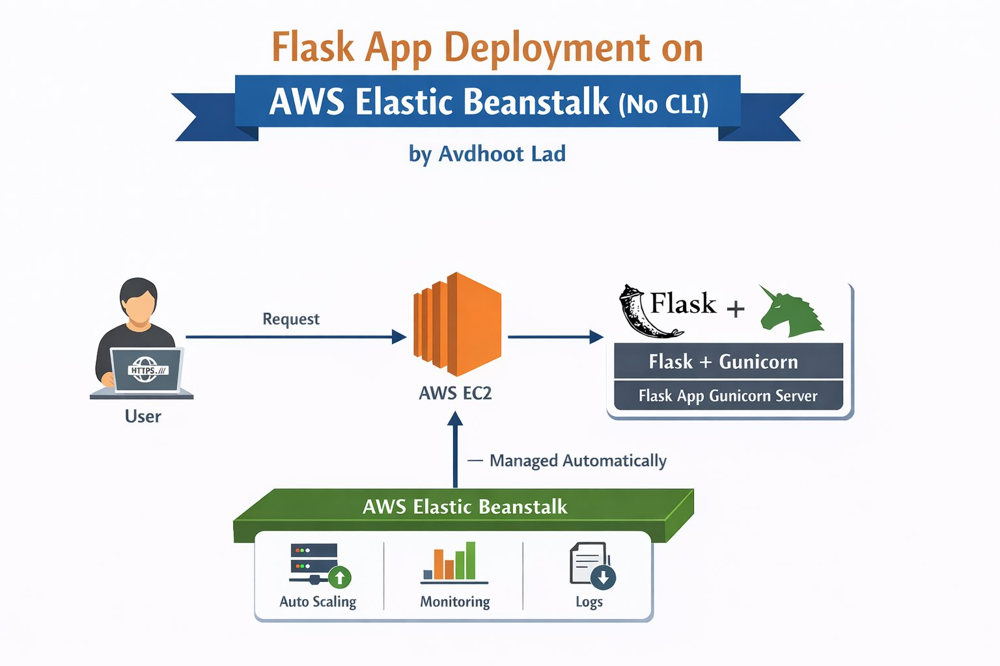

# 🚀 Flask App Deployment on AWS Elastic Beanstalk

<div align="center">



**Deploy a production-ready Flask application to AWS Elastic Beanstalk — no CLI required.**

*by Avdhoot Lad*

[](https://python.org)
[](https://flask.palletsprojects.com)
[](https://gunicorn.org)
[](https://aws.amazon.com/elasticbeanstalk)

</div>

---

## 📋 Table of Contents

- [Overview](#-overview)
- [Architecture](#-architecture)
- [Prerequisites](#-prerequisites)
- [Project Structure](#-project-structure)
- [Setup & Configuration](#-setup--configuration)
- [Deployment Steps](#-deployment-steps)
- [How It Works](#-how-it-works)
- [Monitoring & Logs](#-monitoring--logs)
- [Troubleshooting](#-troubleshooting)

---

## 🌐 Overview

This project demonstrates deploying a **Flask** web application on **AWS Elastic Beanstalk** using only the **AWS Management Console** — no EB CLI or AWS CLI required.

The app runs behind **Gunicorn** (production WSGI server) on an EC2 instance that is **automatically managed** by Elastic Beanstalk, giving you built-in auto scaling, health monitoring, and log access out of the box.

---

## 🏗 Architecture

```
User (HTTPS)
     │
     │  Request
     ▼
┌─────────────┐          ┌──────────────────────────┐
│   AWS EC2   │ ──────▶  │   Flask + Gunicorn        │
│  Instance   │          │   Flask App Server         │
└──────┬──────┘          └──────────────────────────┘
       │ ▲
       │ │  Managed Automatically
       ▼ │
┌──────────────────────────────────────────────┐
│             AWS Elastic Beanstalk            │
│  ┌────────────┬──────────────┬────────────┐  │
│  │ Auto       │  Monitoring  │   Logs     │  │
│  │ Scaling    │  (CloudWatch)│            │  │
│  └────────────┴──────────────┴────────────┘  │
└──────────────────────────────────────────────┘
```

| Component | Role |
|-----------|------|
| **Flask** | Python micro web framework — handles routes & business logic |
| **Gunicorn** | Production WSGI server — serves Flask over HTTP |
| **AWS EC2** | Virtual server running your application |
| **Elastic Beanstalk** | Orchestrates EC2, auto scaling, health checks, logs |

---

## ✅ Prerequisites

- An **AWS account** with Elastic Beanstalk access
- **Python 3.8+** installed locally
- Basic knowledge of Flask

---

## 📁 Project Structure

```
my-flask-app/
├── application.py          # Main Flask app (must use 'application' as object name)
├── requirements.txt        # Python dependencies
├── Procfile                # Tells EB to use Gunicorn
└── .ebextensions/          # (Optional) EB environment config
    └── python.config
```

> ⚠️ **Critical:** AWS Elastic Beanstalk expects the Flask app object to be named **`application`** inside **`application.py`**.

---

## ⚙️ Setup & Configuration

### 1. `application.py`

```python
from flask import Flask

application = Flask(__name__)

@application.route('/')
def index():
    return '<h1>Hello from AWS Elastic Beanstalk!</h1>'

if __name__ == '__main__':
    application.run(debug=True)
```

### 2. `requirements.txt`

```
Flask==2.3.3
gunicorn==21.2.0
```

### 3. `Procfile`

```
web: gunicorn --bind 0.0.0.0:8000 application:application
```

### 4. `.ebextensions/python.config` *(Optional)*

```yaml
option_settings:
  aws:elasticbeanstalk:container:python:
    WSGIPath: application:application
```

---

## 🚀 Deployment Steps

### Step 1 — Zip your project

Select all files (**not** the folder) and compress into a `.zip`:

```
application.py
requirements.txt
Procfile
.ebextensions/
```

### Step 2 — Open AWS Elastic Beanstalk Console

1. Log in to [console.aws.amazon.com](https://console.aws.amazon.com)
2. Search **Elastic Beanstalk** and click **"Create Application"**

### Step 3 — Configure

| Field | Value |
|-------|-------|
| Application name | `my-flask-app` |
| Platform | **Python** |
| Platform branch | Python 3.x on Amazon Linux 2 |
| Application code | Upload your `.zip` file |

### Step 4 — Deploy

Click **"Create application"** and wait ~5 minutes. AWS will automatically:
- Provision an EC2 instance
- Install Python and dependencies from `requirements.txt`
- Start Gunicorn using your `Procfile`
- Configure health checks

### Step 5 — Access Your App

Once the environment shows **Green (Healthy)**:

```
http://my-flask-app.eba-xxxxxxxx.us-east-1.elasticbeanstalk.com
```

---

## 🔄 How It Works

```
1. User sends HTTPS request to the Elastic Beanstalk URL
2. Request is routed to the EC2 instance
3. Gunicorn (WSGI server) receives the request
4. Flask processes the request and returns a response
5. Elastic Beanstalk continuously monitors health,
   scales EC2 instances, and manages the environment
```

---

## 📊 Monitoring & Logs

Elastic Beanstalk provides built-in observability from the console:

| Feature | Description | Access |
|---------|-------------|--------|
| **Auto Scaling** | Adds/removes EC2 instances based on traffic | Configuration > Capacity |
| **Monitoring** | CPU, requests, latency metrics via CloudWatch | Monitoring tab |
| **Logs** | Application and server logs | Logs > Request last 100 lines |

---

## 🛠 Troubleshooting

| Problem | Solution |
|---------|----------|
| Environment stuck in **Pending** | Check EC2 instance limits in your region |
| **502 Bad Gateway** | Verify `Procfile` exists and Gunicorn command is correct |
| **App not loading** | Ensure Flask object is named `application` in `application.py` |
| **Dependencies missing** | Confirm `requirements.txt` is in the root of your `.zip` |
| **Health check failing** | Add a `/` route that returns HTTP `200` |
| **Environment not updating** | Re-upload a new `.zip` via Console > Upload and Deploy |

---

## 📝 License

This project is open source under the [MIT License](LICENSE).

---

<div align="center">
  Crafted with love by Avdhoot Lad
</div>
